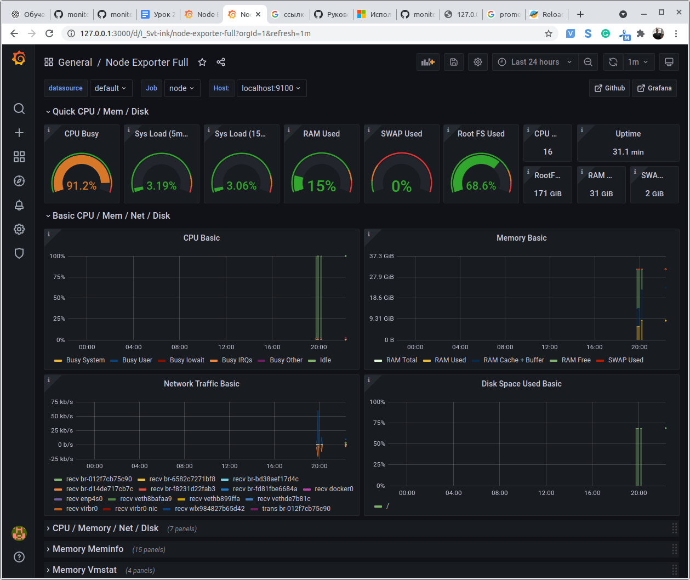
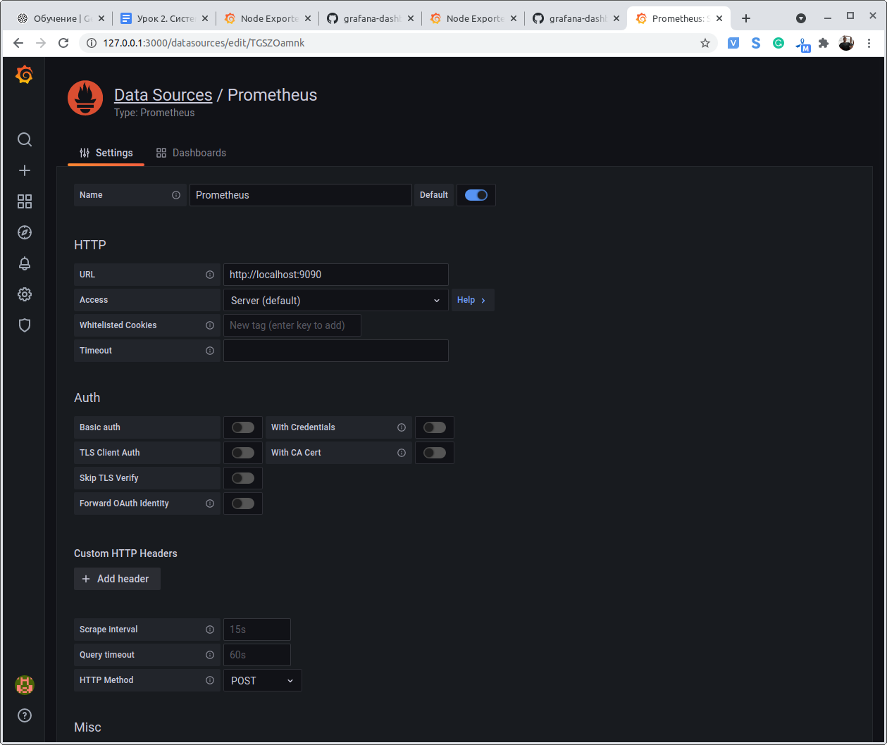

# Урок 2

## Prometheus

### Задание

1. Запустить Prometheus.
2. Настроить мониторинг для инстанса, на котором запущен Prometheus.
3. Настроить Alertmanager на отправку оповещений в Telegram.
4. *Настроить basic auth для Alertmanager и Prometheus.
5. *Запустить и настроить Karama и/или Alerta для визуализации алертов.

### Выполнение

1. Запустить Prometheus.

[docker-compose.yml](docker-compose.yml "docker-compose")

2. Настроить мониторинг для инстанса, на котором запущен Prometheus.

[prometheus.yml](prometheus.yml "prometheus")

3. Настроить Alertmanager на отправку оповещений в Telegram.

[alertmanager.yml](alertmanager.yml "alertmanager")

## Grafana

### Задание

1. Запустить Grafana.
2. Добавить дашборд node-exporter и источник данных из первого задания.
3. * Настроить ограниченный доступ для нового пользователя GeekBrain-User:
    * Роль Viewer в организации GeekBrain-Ogr.
    * Роль Editor для дашборда Node-exporter в организации GeekBrain-Ogr.

### Выполнение

### 1. Запустить Graphana

<code>docker run -d -p 3000:3000 --name grafana grafana/grafana</code>

### 2. Добавить дашборд node-exporter и источник данных из первого задания.

