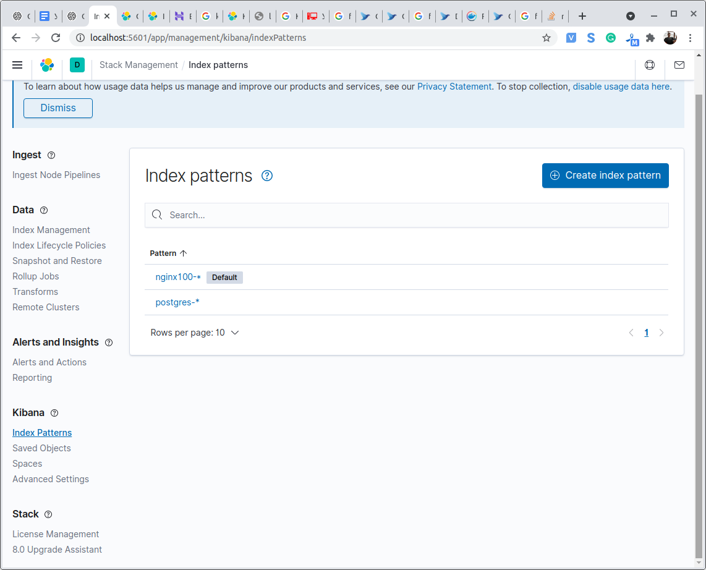
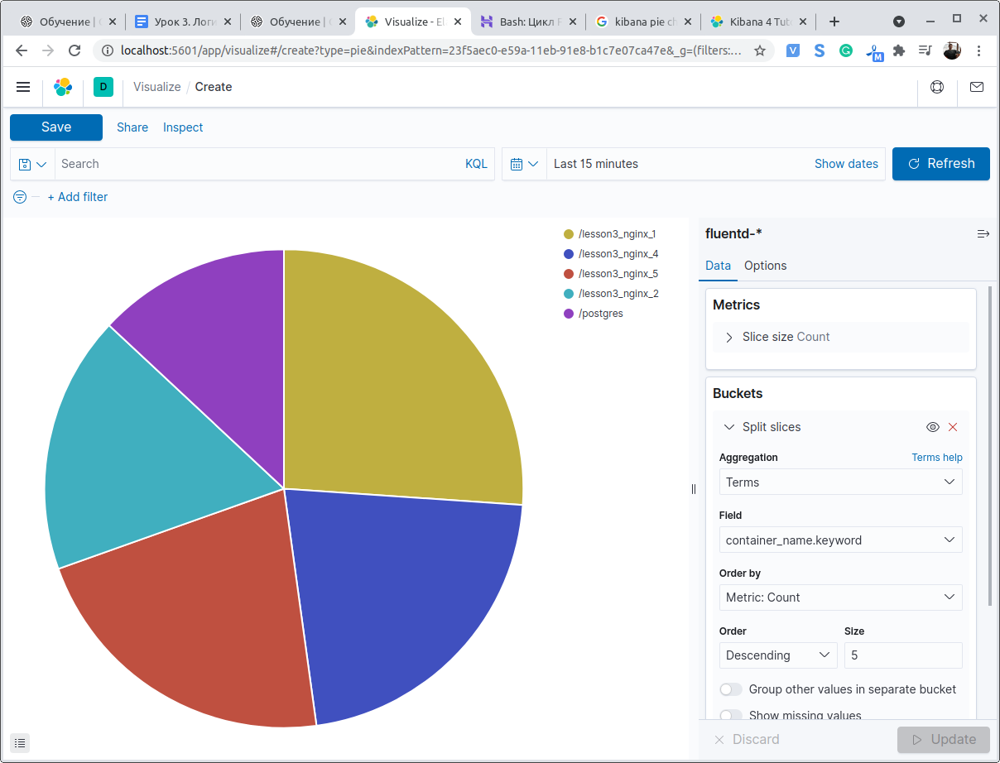
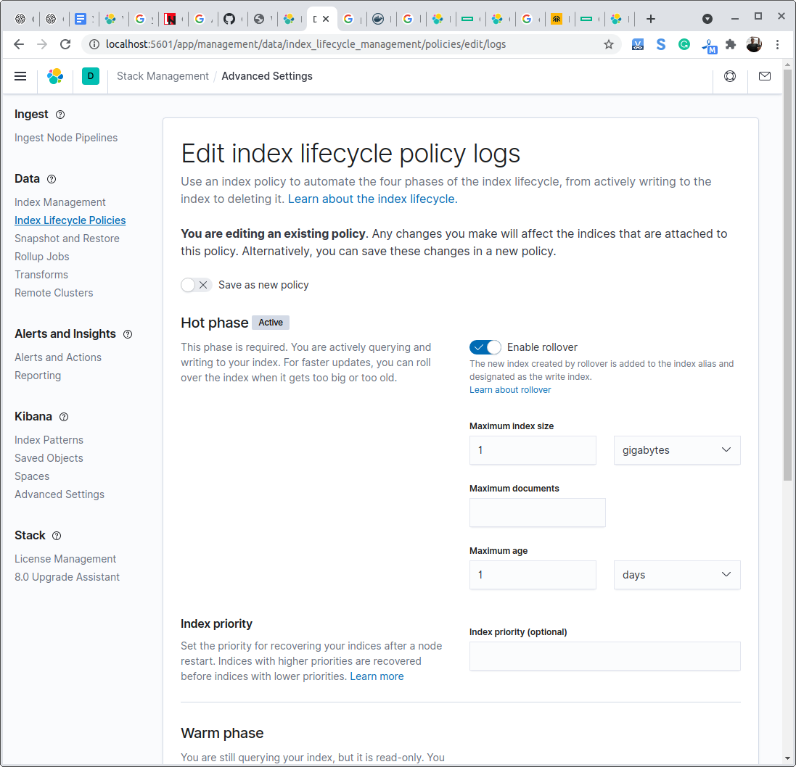

# Урок 3

### Задание

1. Запустить Elastic Stack и несколько сервисов для генерации логов;
2. Каждый сервис должен писать логи в отдельный индекс;
3. Настроить ротацию логов в 1 день;

### Выполнение

1. Запустить Elastic Stack и несколько сервисов для генерации логов;

[docker-compose.yml](docker-compose.yml "docker-compose")

2. Настроить мониторинг для инстанса, на котором запущен Prometheus.

3. Настроить ротацию логов в 1 день;

