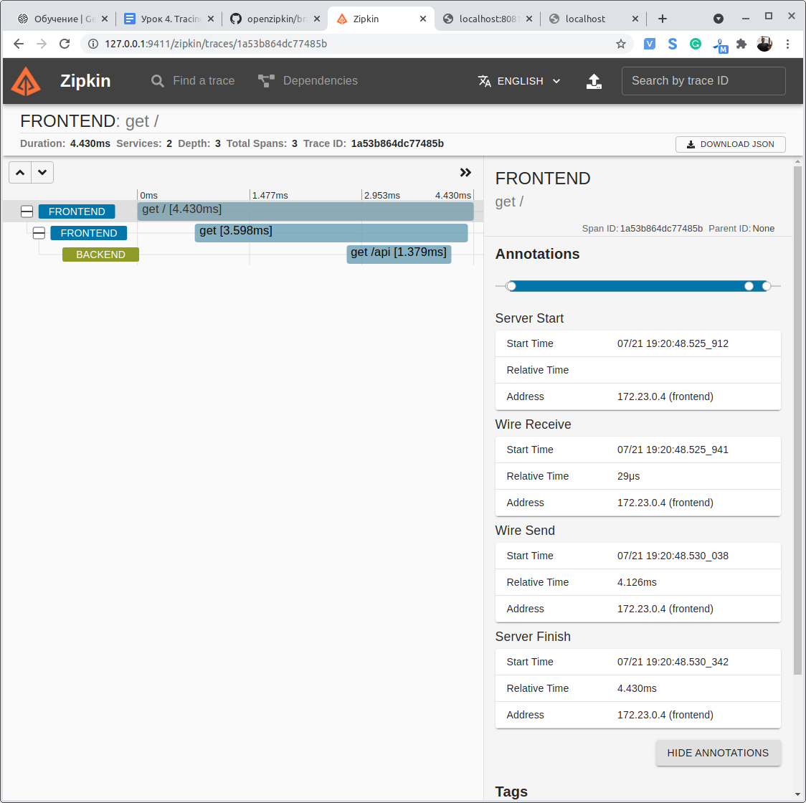
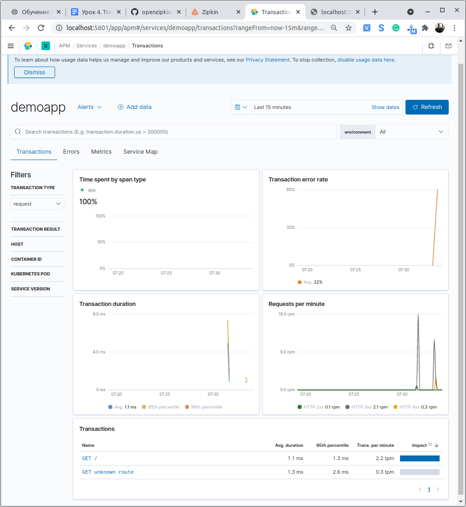
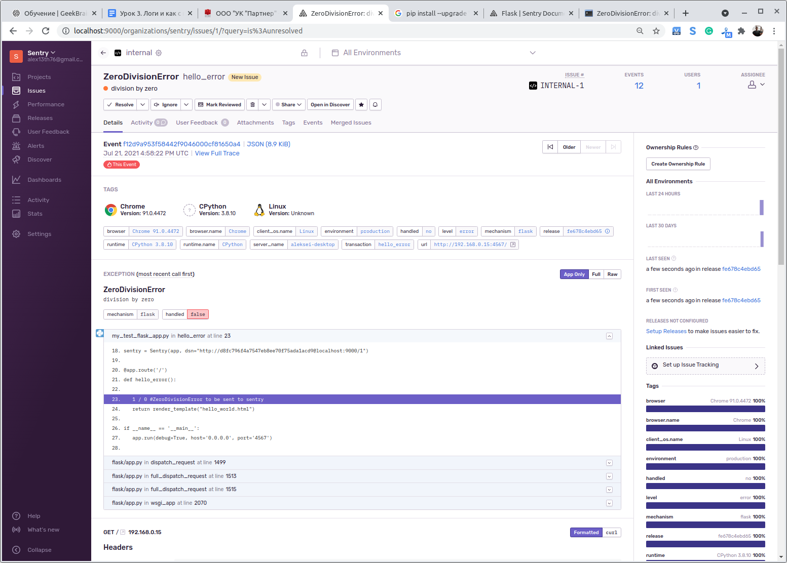

# Урок 4

## Jaeger или Zipkin:
### Задание

1. Запустить один из трассировщиков и приложение, отправляющее в них свои данные;

2. *использовать в качестве хранилища Elasticsearch;
3. *собрать метрики с помощью Prometheus.

## Elastic APM:
### Задание

1. Запустить Elastic APM и приложение для него.

## Sentry
### Задание

1. Разрвернуть sentry

